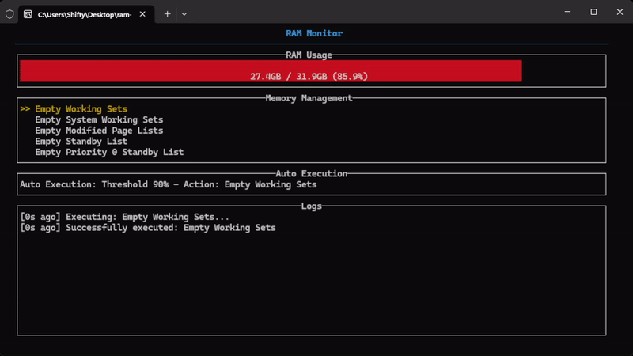

# RAM Observer RS 🚀

A terminal-based RAM monitoring tool written in Rust that provides real-time memory management capabilities using Microsoft's RAMMap utility.

## Demo



## Features

- 📊 Real-time RAM and page file usage monitoring with visual gauges
- 🔄 Automatic memory management based on configurable thresholds
- 🛠 Direct integration with Microsoft's RAMMap utility
- ⌨️ Keyboard shortcuts for quick actions
- 📝 Action logging with timestamps
- 🔧 Config support

## Memory Management Actions

- Empty Working Sets
- Empty System Working Sets
- Empty Modified Page Lists
- Empty Standby List
- Empty Priority 0 Standby List

## Controls

- `1-5`: Quick action keys for memory management
- `↑/↓`: Navigate through actions
- `Enter`: Execute selected action
- `Shift + A`: Cycle through auto-execution actions
- `Shift + T`: Cycle auto-execution threshold (50-95%, 5% increments)
- `q`: Quit application

## Auto-Execution

The tool can automatically execute memory management actions when RAM usage exceeds a configured threshold (default: 90%).

## Installation

1. Download the latest release from the releases page
2. Extract and run the executable
3. RAMMap will be automatically downloaded on first use (if not already present)

## Building from Source


```bash
git clone https://github.com/Shifty-1337/ram-observer-rs.git
```

```bash
cd ram-observer-rs
```

```bash
cargo build --release

```

## Requirements

- Windows OS (RAMMap dependency)
- Internet connection for first-time RAMMap download

## License

MIT License

## Acknowledgments
- Uses Microsoft's [RAMMap utility from Sysinternals](https://docs.microsoft.com/en-us/sysinternals/downloads/rammap)
- Built with [Rust](https://www.rust-lang.org/) and [Ratatui](https://ratatui.rs/)